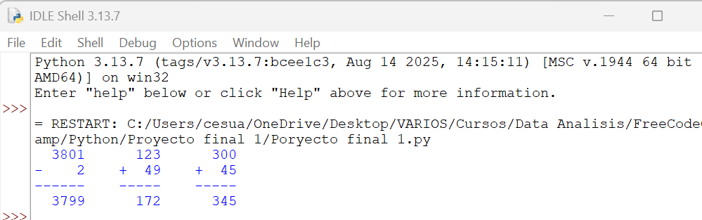
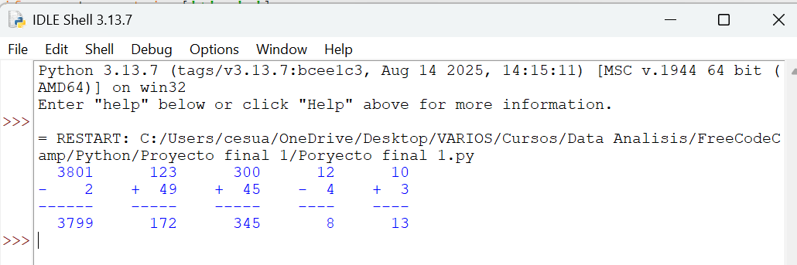

# EleganciaAritmética 🧮

**Última actualización: 23 de septiembre de 2025, 11:26 AM -05:00**

Bienvenido a mi repositorio de proyectos en Python. Este proyecto es una aplicación de consola que organiza problemas aritméticos de forma vertical y elegante, facilitando su lectura y resolución. El código fue desarrollado como parte de mi aprendizaje continuo en Python. ¡Cualquier comentario o sugerencia es bienvenida!

## Proyecto

### EleganciaAritmética
- **Descripción**: Este programa toma una lista de problemas aritméticos (sumas y restas) y los formatea verticalmente con alineación a la derecha, guiones inferiores y, opcionalmente, las respuestas. Utiliza listas y manipulación de cadenas para lograr un diseño claro y profesional, ideal para estudiantes o ejercicios matemáticos.
- **Archivo**: [arithmetic_arranger.py](arithmetic_arranger.py)
- **Ejemplo**: La entrada `["3801 - 2", "123 + 49", "300 + 45"]` con `show_answers=True` produce:
- .
- - **Habilidades**: Listas, manipulación de cadenas (`rjust`, `join`), funciones, lógica condicional, validación de entrada.
- **Captura de pantalla**:
 
---

## Requisitos

- Python 3.x instalado en el sistema.
- Acceso a una terminal o entorno compatible con Python (como IDLE).

---

## Instrucciones de Uso

1. Asegúrate de haber clonado el repositorio y de tener Python instalado.
2. Navega a la carpeta del proyecto en tu terminal.
3. Ejecuta el programa con el siguiente comando:

 ```bash
 python arithmetic_arranger.py
