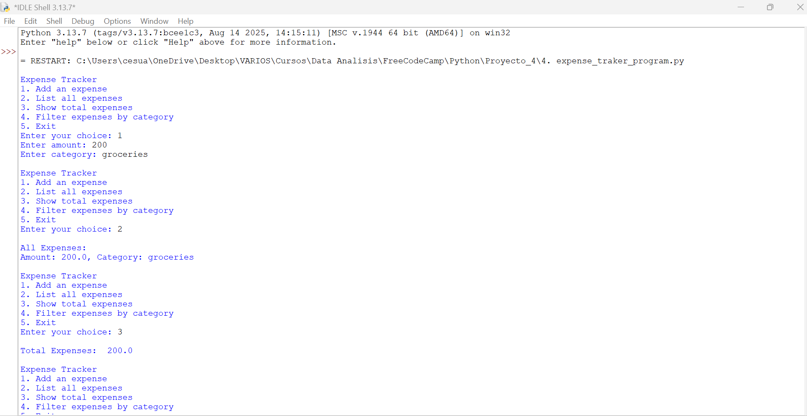

Markdown

# Rastreador de Gastos 💰

**Última actualización: 17 de septiembre de 2025, 11:00 AM -05:00**

Bienvenido a mi repositorio de proyectos en Python. Este proyecto es una aplicación de consola que te permite rastrear y administrar tus gastos de manera sencilla. El código fue desarrollado como parte de mi aprendizaje continuo. ¡Cualquier comentario o sugerencia es bienvenida!

## Proyecto

### Rastreador de Gastos (Expense Tracker)
- **Descripción**: Este programa de seguimiento de gastos permite a los usuarios **agregar, listar, totalizar y filtrar** gastos por categoría. La aplicación utiliza un bucle `while` para presentar un menú interactivo en la consola, lo que facilita la gestión de las finanzas personales.
- **Archivo**: [expense_tracker_program.py](expense_tracker_program.py)
- **Ejemplo**: El usuario puede ingresar un gasto con una cantidad y una categoría (`comida`, `transporte`, etc.) y luego ver el total de sus gastos o filtrar por una categoría específica.
- **Habilidades**: Estructuras de datos (listas y diccionarios), bucles `while`, funciones, funciones `lambda` para operaciones de mapeo y filtrado, y entrada/salida de usuario.
- **Captura de pantalla**:
  

---

## Instrucciones de Uso

1.  Asegúrate de haber clonado el repositorio y de tener Python instalado.
2.  Navega a la carpeta del proyecto en tu terminal.
3.  Ejecuta el programa con el siguiente comando:
    ```bash
    python expense_tracker.py
    ```
4.  Requisitos: Python 3.x

---

## Tecnologías

-   **Lenguaje**: Python 3.x
-   **Editor**: PowerShell

---

## Licencia

[MIT License](LICENSE) - Este proyecto es de uso y modificación libre.

---

## Contribuciones

-   Abre un "Issue" para sugerencias o reportar errores.
-   Conecta en [LinkedIn](https://www.linkedin.com/in/rickandmorty8/).
